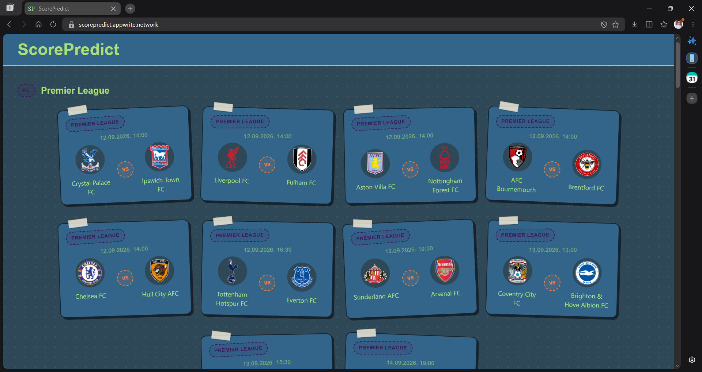

# ScorePredict

It's a website that helps to predict the scores of a match, using my own AI model.
Backend is running on Appwrite with my self-written Python functions, frontend uses a html-tailwind css-alpine js stack.
Click on the link, if you want to try out: https://scorepredict.appwrite.network/

## Setup

### 1. Frontend
If you want to setup your own version:

1. `git clone "https://github.com/Brtz17/ScorePredict"`
2. `cd frontend`
3. `npm install`
4. `npm run dev`

Now you can customize the frontend!✨✨
>Good to know: Now the project uses my own backend on Appwrite, so you won't need even just to sign up to Appwrite.

### 2. Backend (this is a bit harder)
I have two main functions, you can edit: 'fetch' and 'predict'. To achieve this, follow these steps:

1. `npm install -g appwrite-cli`
2. `appwrite login`
3. `appwrite init project` (creates your own project, replaces the IDs in *'appwrite.config.json'*)
4. Edit the function code in *'functions/fetch/src/main.py'* and *'functions/predict/src/main.py'*
5. `appwrite push functions`

>Note: I wouldn't recommend you to change important things in the code, because this is a really complicated project (for me at least)

## Environment variables

### Frontend (`.env` in `frontend/`)
| Variable | Description |
|---|---|
| `VITE_APPWRITE_ENDPOINT` | Appwrite API endpoint |
| `VITE_APPWRITE_PROJECT_ID` | Appwrite project ID |
| `VITE_APPWRITE_PROJECT_NAME` | Appwrite project name |

>Skip the next 2 tables, if you don't want to make your own backend

### `fetch` function (set in Appwrite Console → Function → Variables)
| Variable | Required | Default |
|---|---|---|
| `APPWRITE_FUNCTION_API_ENDPOINT` | yes | — |
| `APPWRITE_FUNCTION_PROJECT_ID` | yes | — |
| `FOOTBALL_DATA_ORG_KEY` | yes | — |
| `APPWRITE_FUNCTION_API_KEY` | no | uses request header key if unset |
| `APPWRITE_DATABASE_ID` | no | `prediction_db` |
| `RESULTS_LOOKBACK_DAYS` | no | `10` |
| `TIME_BUDGET_S` | no | `240` |
| `FIXTURES_BATCH_SIZE` | no | `30` |
| `SEED_LEAGUES_CONFIG` | no | `false` |
| `RUN_PROCESSED_BACKFILL` | no | `false` |
| `BACKFILL_CHUNK_SIZE` | no | `500` |
| `BACKFILL_TIME_BUDGET_S` | no | `800` |

### `predict` function (set in Appwrite Console → Function → Variables)
| Variable | Required | Default |
|---|---|---|
| `APPWRITE_FUNCTION_API_ENDPOINT` | yes | — |
| `APPWRITE_FUNCTION_PROJECT_ID` | yes | — |
| `DATABASE_ID` | yes | — |
| `PREDICTIONS_COLLECTION_ID` | yes | — |
| `APPWRITE_API_KEY` | no | uses `x-appwrite-key` header if unset |
| `UPCOMING_FIXTURES_COLLECTION_ID` | no | `upcoming_fixtures` |

## Tech stack
- **Frontend:** HTML, Tailwind CSS v4, Alpine.js, built with Vite
- **Backend:** Appwrite Cloud (Functions, Databases), Python
- **Prediction model:** self-written bivariate Poisson / Dixon-Coles model (pandas, numpy, scikit-learn, scipy, joblib)
- **Data source:** football-data.org API